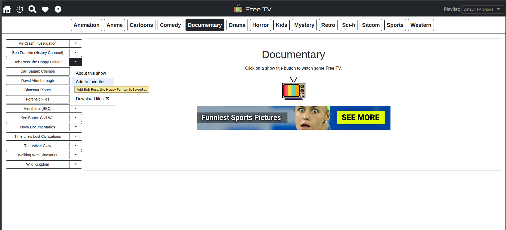
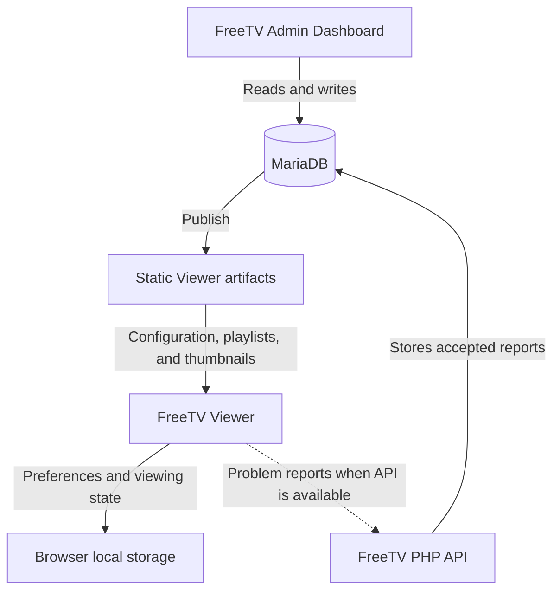

# FreeTV Viewer

 FreeTV Viewer is a browser-based interface for exploring and watching FreeTV’s hand-picked collection of shows and movies hosted by the Internet Archive.

The Viewer consumes published static configuration, playlist JSON, and thumbnail artifacts. It does not connect directly to MariaDB or require the FreeTV Admin Dashboard for normal viewing. Watch FreeTV online at: [https://freetv.today](https://freetv.today).

<div style="text-align: center; margin-top: 30px;">
<a href="public/assets/freetv-screenshot.jpg" target="_blank" title="Screenshot of FreeTV Admin Dashboard"></a>
</div>

## Features

* Easy-to-use graphical interface for browsing and watching FreeTV content
* Browse multiple playlists and show categories
* Search the current playlist
* Save favorite shows in the browser
* View recently watched shows
* Resume previously started videos
* Responsive layouts for desktop and mobile browsers
* Installable Progressive Web App
* Report unavailable or problematic shows when connected to the FreeTV API
* Built-in help and troubleshooting information

## Requirements

### Using the Viewer

* A modern web browser
* JavaScript enabled
* Internet access for published FreeTV data and Internet Archive media

The Viewer stores preferences such as the selected playlist, favorites, recently watched shows, and playback state in the browser. No Viewer account is required.

### Viewer Development

* Node.js 22 or newer
* npm
* A modern web browser

Frontend dependencies, including Preact, Preact Signals, Preact ISO, Vite, and Bootstrap, are installed through npm.

PHP and MariaDB are not required for normal standalone Viewer development. Report a Problem requires a compatible API endpoint in production; the Vite development server provides a non-persistent mock response for local interface testing.

## Getting Started

The Viewer can run independently using the official Viewer data published at `freetv.today`. PHP, MariaDB, the Admin Dashboard, and the other FreeTV repositories are not required for this development mode.

1. Clone or download `freetv-viewer`.
2. In a terminal, navigate to the `freetv-viewer` directory and run:

   ```bash
   npm install
   ```

3. From the same directory, start the Vite development server:

   ```bash
   npm run dev
   ```

4. Open the local URL printed by Vite in your browser.

By default, the development server proxies requests for `/config.json`, `/playlists/`, and `/thumbs/` to `https://freetv.today`. The Viewer application itself runs locally while using the currently published official data.

The Vite development server also provides a non-persistent mock response for `/api/report-problem.php`. This allows the Report a Problem interface to be tested without running the FreeTV PHP backend. Mock submissions are not saved or sent to the official FreeTV site.

To develop with local disposable Viewer data instead, see [Local Data Development](#local-data-development).

## How do I ...  ?

If you are an end-user and just want to watch FreeTV, go to the website: https://freetv.today

If you are a developer: `freetv-viewer` can be developed and run on its own locally; you do not need the Admin Dashboard, MariaDB, or a complete FreeTV production assembly to work on the Viewer. The table below covers tasks within this repository. For help choosing another FreeTV repository, see the [FreeTV organization overview](https://github.com/freetv-today).<br/>

| I want to... | What do I do? | What happens? |
| --- | --- | --- |
| **Run the Viewer with official remote data** | Navigate to `freetv-viewer`, run `npm install`, and then run `npm run dev`. See [Getting Started](#getting-started). | Starts the local Viewer frontend and proxies data requests to the currently published artifacts at `freetv.today`. |
| **Run the Viewer with local data** | Set `FREETV_DATA_MODE=local`, install disposable Viewer data, and run `npm run dev`. See [Local Data Development](#local-data-development). | Loads configuration, playlists, and thumbnails from the Viewer’s ignored `public/` data paths instead of `freetv.today`. |
| **Test the Report a Problem interface locally** | Run the Viewer with `npm run dev` and submit a problem report. | Vite returns a simulated success response. Nothing is persisted or sent to the official FreeTV site. |
| **Build only the Viewer frontend** | Navigate to `freetv-viewer` and run `npm run build`. See [Build the Viewer](#build-the-viewer). | Creates and validates a frontend-only production build in `dist/`. Viewer data, Admin files, and PHP APIs are not included. |
| **Run the Viewer contract tests** | Run `npm run test:viewer-dist` and `npm run test:pwa`. See [Testing](#testing). | Validates the production-build contract and Progressive Web App files without creating a complete FreeTV assembly. |

## Architecture

The FreeTV Viewer is a Preact single-page application built with Vite and styled with Bootstrap. It reads published static artifacts and presents them as searchable playlists, categories, show information, and playable Internet Archive content.

The Viewer does not connect to MariaDB. Content changes originate in the FreeTV Admin Dashboard and become available to the Viewer only after the Admin publication process generates updated static artifacts.

### Data Flow



MariaDB is authoritative for Admin-managed data. The Viewer consumes:

```text
/config.json
/playlists/index.json
/playlists/*.json
/thumbs/*
```

Video content is hosted by the Internet Archive rather than by the Viewer repository or the FreeTV Data repository.

### Data Modes

The Viewer supports two Vite development data modes:

| Mode     | Data source                                             | Intended use                                                              |
| -------- | ------------------------------------------------------- | ------------------------------------------------------------------------- |
| `remote` | Published artifacts proxied from `https://freetv.today` | Standalone Viewer development using the current official data.            |
| `local`  | Disposable artifacts under `freetv-viewer/public/`      | Testing local dataset changes or coordinated Viewer and Data development. |

`remote` is the default when `FREETV_DATA_MODE` is omitted.

These modes apply only to the Vite development server. A production Viewer build does not contain a development data proxy. In a deployed application, Viewer artifacts must be available from the same public origin and paths expected by the Viewer.

### Browser-Local State

The Viewer uses browser local storage for Viewer-specific state, including:

* the selected playlist;
* cached configuration and playlist data;
* favorites;
* recently watched shows; and
* saved playback position.

This state belongs to the individual browser profile. It is not stored in MariaDB, synchronized between devices, or associated with a Viewer account.

Published timestamps allow the Viewer to detect when cached configuration or playlist data no longer matches the current static artifacts. When newer data is available, the Viewer refreshes its cached copy.

The browser must permit local storage. If storage is unavailable, the Viewer displays a storage error rather than starting with incomplete state.

### Backend-Dependent Features

Normal browsing uses static Viewer artifacts, while playback retrieves media from the Internet Archive. Neither requires the FreeTV PHP API or MariaDB.

Report a Problem is an optional backend-dependent feature. In production, the Viewer submits reports to:

```text
/api/report-problem.php
```

A deployment without a compatible endpoint can still display and play Viewer content, but problem reports cannot be persisted.

During Vite development, the Viewer intercepts that path and returns a simulated success response. The mock allows the interface to be tested without a PHP backend and never records or forwards the submission.

### Progressive Web App

The Viewer includes a web application manifest and service worker so supported browsers can install it as a Progressive Web App.

The service worker caches the Viewer application shell and static frontend assets. It deliberately bypasses its cache for:

```text
/config.json
/playlists/
/thumbs/
/api/
/admin/
```

Viewer data, thumbnails, API responses, and Admin resources therefore continue to use the network. The Progressive Web App installation does not make the published FreeTV dataset or Internet Archive videos available offline.

## Project Structure

The following tree highlights the files and directories most relevant to developing, building, and deploying the Viewer. It does not list every component or static asset.

```text
freetv-viewer/
├── public/
│   ├── assets/                Viewer images, icons, fonts, help content, and static assets
│   ├── config.json            Disposable local Viewer configuration; ignored by Git
│   ├── playlists/             Disposable local playlist data; ignored by Git
│   ├── thumbs/                Disposable local thumbnails; ignored by Git
│   ├── .htaccess              Viewer and Admin single-page application routing rules
│   ├── manifest.json          Progressive Web App manifest
│   └── service-worker.js      Viewer application-shell cache behavior
├── scripts/
│   └── validate-viewer-dist.js
│                              Production Viewer build validator
├── src/
│   ├── components/            Layout, navigation, modal, loader, help, and UI components
│   ├── context/               Published configuration and playlist state
│   ├── hooks/                 Viewer data, favorites, search, thumbnail, and playback behavior
│   ├── pages/                 Viewer route pages
│   ├── signals/               Shared reactive UI state
│   ├── index.jsx              Viewer application entry point
│   ├── style.css              Viewer-specific styling
│   └── utils.js               Shared Viewer utilities
├── tests/                     Viewer build and Progressive Web App contract tests
├── dist/                      Generated frontend-only production build; ignored by Git
├── .env.local.example         Local-data development configuration example
├── index.html                 Vite HTML entry point
├── jsconfig.json              JavaScript checking and module aliases
├── package.json               Viewer commands and dependencies
├── package-lock.json          Locked npm dependencies
├── vite.config.js             Development data modes and production build configuration
├── LICENSE                    GNU GPL version 3 license
└── README.md                  Viewer operating documentation
```

The ignored `public/config.json`, `public/playlists/`, and `public/thumbs/` paths exist only when local development data has been installed. They are not copied into the frontend-only production build.

The generated `dist/` directory contains the Viewer application shell and frontend assets. It deliberately excludes Viewer data, Admin files, PHP APIs, and private runtime configuration.

## Development

Standalone Viewer development requires only the Viewer’s npm dependencies and a source of published Viewer data.

The default remote-data workflow is described in [Getting Started](#getting-started). Use local data when testing unpublished dataset changes, working without the official remote artifacts, or coordinating Viewer development with `freetv-data`.

### Local Data Development

Local data mode loads Viewer artifacts from these paths:

```text
freetv-viewer/public/
├── config.json
├── playlists/
└── thumbs/
```

These paths contain disposable development data and are ignored by Git. They are not part of the Viewer source repository and must not be committed.

The recommended installation workflow uses [`freetv-tooling`](https://github.com/freetv-today/freetv-tooling). Prepare local copies of:

```text
freetv-data/
freetv-tooling/
freetv-viewer/
```

The default Tooling configuration expects these repositories to be siblings. If they are stored elsewhere, configure their locations in `freetv-tooling/config/paths.json`.

1. Install the npm dependencies in `freetv-viewer` and `freetv-tooling`.

2. In `freetv-viewer`, create `.env.local` from `.env.local.example`:

   ```dotenv
   FREETV_DATA_MODE=local
   ```

3. In a terminal, navigate to `freetv-tooling` and run:

   ```bash
   npm run status
   npm run dev:install-viewer-data
   ```

4. Navigate to `freetv-viewer` and start the Viewer:

   ```bash
   npm run dev
   ```

5. Open the local URL printed by Vite.

<br/>

> [!NOTE]
> `dev:install-viewer-data` removes any existing disposable Viewer data from the three paths above and replaces it with the current canonical artifacts from the configured `freetv-data` repository. Other files under `freetv-viewer/public/` are preserved.

<br/>

Rerun the installation command whenever the canonical local dataset changes:

```bash
npm run dev:install-viewer-data
```

Do not edit the installed Viewer copies as the source of a dataset. MariaDB is authoritative for working Admin data, and `freetv-data` owns the canonical distributable artifacts.

To remove the disposable local Viewer data, navigate to `freetv-tooling` and run:

```bash
npm run dev:clean-viewer-data
```

This removes only:

```text
freetv-viewer/public/config.json
freetv-viewer/public/playlists/
freetv-viewer/public/thumbs/
```

To return to official remote data, remove `.env.local` or change its value to:

```dotenv
FREETV_DATA_MODE=remote
```

Restart Vite after changing the data mode.

`FREETV_DATA_MODE` accepts only `remote` or `local`. If it is omitted, the Viewer defaults to `remote`. Any other value prevents the development server from starting.

### Build the Viewer

In a terminal, navigate to `freetv-viewer` and run:

```bash
npm run build
```

This creates a frontend-only production build in `dist/` and automatically runs the production build validator.

The generated build contains the Viewer application shell and static frontend assets. It does not include:

* Viewer configuration, playlists, or thumbnails
* The FreeTV Admin Dashboard
* PHP APIs or Composer dependencies
* Private runtime configuration

Local data installed under `public/` is deliberately excluded from the production build.

Use [`freetv-tooling`](https://github.com/freetv-today/freetv-tooling) to create a complete FreeTV production assembly containing the Viewer, published data, Admin Dashboard, PHP APIs, and required dependencies.

### Testing

Run the Viewer production-build contract tests with:

```bash
npm run test:viewer-dist
```

Run the Progressive Web App contract tests with:

```bash
npm run test:pwa
```

The production-build tests verify which files and directories may appear in the frontend-only `dist/` directory. The Progressive Web App tests verify the manifest, service worker, cache behavior, and related application-shell requirements.

Running `npm run build` also validates the generated `dist/` directory automatically.

## License

This code is released under the [GPL v3](LICENSE) license.
