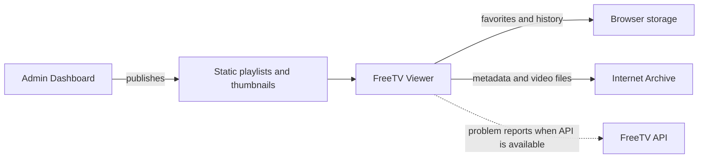

# FreeTV Viewer

FreeTV Viewer is a browser application for browsing and watching FreeTV’s curated shows and movies hosted by the Internet Archive. Version 4 is a Preact single-page application built with Vite. It uses the browser’s HTML5 video player to play media files directly from the Internet Archive.

The Viewer reads published playlists and thumbnails as static files. It does not connect to MariaDB. The Admin Dashboard publishes those artifacts, and `freetv-tooling` coordinates local development and complete production builds.

## Features

- Browse playlists and show categories
- Search the selected playlist
- View show information and thumbnails
- Play Internet Archive videos directly in the browser
- Browse episodes and select playback speed, volume, and fullscreen mode
- Save favorites and recently watched shows in browser storage
- Report problems when the FreeTV API is available
- Use responsive layouts on desktop and mobile browsers

## Requirements

### Using the Viewer

- A modern browser with JavaScript enabled
- Internet access for published Viewer data and Internet Archive media

Favorites, recently watched shows, the selected playlist, and the queued show are stored in the browser. They are not synchronized between devices and do not require a Viewer account.

### Viewer Development

- Node.js 22 or newer
- npm
- A modern web browser

The Viewer uses Preact, Preact ISO, Bootstrap, Bootstrap Icons, and Vite. npm installs the frontend dependencies.

## Getting Started

The Viewer needs published playlist and thumbnail files. The recommended local workflow uses `freetv-tooling` to install disposable copies from `freetv-data`.

1. Clone the `freetv-viewer`, `freetv-tooling`, and `freetv-data` repositories as siblings, or configure their locations in `freetv-tooling/config/paths.json`.
2. Run `npm install` in `freetv-viewer` and `freetv-tooling`.
3. From `freetv-tooling`, run:

   ```bash
   npm run status
   npm run dev:install-viewer-data
   ```

4. Start the Viewer from either repository:

   ```bash
   # In freetv-viewer
   npm run dev

   # Or in freetv-tooling
   npm run dev:viewer
   ```

5. Open the local URL printed by Vite.

The Viewer loads its presentation settings from `public/whitelabel.config.json`. It loads the selected playlist from `/playlists/` and thumbnails from `/thumbs/`. The Tooling data-install command copies those published data paths from `freetv-data` into the Viewer’s `public/` directory. It does not require MariaDB.

The development server provides a simulated success response for `/api/report-problem.php`. Development reports are not saved or sent to the official FreeTV site.

For coordinated Viewer, Admin Dashboard, and PHP development, use `npm run dev:all` from `freetv-tooling`. That workflow requires the Admin and PHP development prerequisites described in the Tooling and Server documentation.

## Architecture

The Viewer’s main data flow is:


```mermaid
flowchart LR
    ADMIN["Admin Dashboard"] -->|"publishes"| DATA["Static playlists and thumbnails"]
    DATA --> VIEWER["FreeTV Viewer"]
    VIEWER -->|"favorites and history"| STORAGE["Browser storage"]
    VIEWER -->|"metadata and video files"| IA["Internet Archive"]
    VIEWER -.->|"problem reports when API is available"| API["FreeTV API"]
```

The Viewer reads:

```text
/whitelabel.config.json
/playlists/index.json
/playlists/<playlist filename>
/thumbs/<thumbnail filename>
```

The Admin Dashboard also publishes `/config.json`, which contains the existing Viewer setting data such as `show_ads`. Version 4 currently ignores that file. Its presentation settings are in `whitelabel.config.json`.

When a show is selected, the Viewer requests its metadata from the Internet Archive, chooses playable media files, and streams the selected file from the Archive. The media is not hosted by the Viewer or Data repositories.

### Browser Storage

The Viewer stores the selected playlist, favorites, recently watched shows, and current queued show in browser local storage. Clearing browser site data removes these preferences. The Viewer does not currently save or resume video playback position.

### Progressive Web App

Version 4 does not register or provide a Progressive Web App. The root `service-worker.js` currently included in the production build is a temporary migration worker: it removes the v3 Viewer’s `freetv-static-v4` app-shell cache and unregisters itself. It does not cache v4 files or provide offline support. Remove it after the v3 transition; any future PWA support will be an optional addition.

## Development and Build

Run the standalone Viewer development server with:

```bash
npm run dev
```

Build the Viewer frontend with:

```bash
npm run build
```

The frontend build is written to `dist/`. It contains the Viewer application, branding assets and settings, the Apache `.htaccess` SPA routing rules, and the temporary migration worker. This lets the Viewer be deployed as a standalone app. Tooling validates and includes the same routing file in the complete production assembly. The frontend build does not include published playlists, thumbnails, the Admin Dashboard, or the PHP API.

To build and verify the complete FreeTV production package, run `npm run build:all` from `freetv-tooling`. Tooling combines the Viewer and Admin frontend builds, PHP runtime, and current published data. It creates local files only; deployment is a separate operation.

## Project Structure

```text
freetv-viewer/
├── public/
│   ├── freetv-small.png          Navigation logo
│   ├── freetv.png                Main Viewer logo
│   ├── service-worker.js         Temporary v3 cache cleanup worker
│   └── whitelabel.config.json    Viewer presentation settings
├── src/
│   ├── components/               Navigation, show display, and player components
│   ├── data/                     Playlist, Archive, search, and browser-storage access
│   ├── pages/                    Viewer routes
│   ├── state/                    Shared application state
│   ├── App.jsx                   Routes and application entry point
│   └── style.css                 Viewer styles
├── index.html                    Vite HTML entry point
├── package.json                  Dependencies and npm commands
├── vite.config.js                Vite build and development configuration
└── README.md                     Viewer documentation
```

Tooling installs disposable `config.json`, `playlists/`, and `thumbs/` data under `public/`. Do not edit those installed data copies as the canonical source; maintain published data through the Admin and Data repository workflows.

## Related Repositories

- [`freetv-server`](https://github.com/freetv-today/freetv-server) contains the Admin Dashboard, PHP API, and publication system.
- [`freetv-data`](https://github.com/freetv-today/freetv-data) contains published datasets, playlists, thumbnails, and First Run packages.
- [`freetv-tooling`](https://github.com/freetv-today/freetv-tooling) coordinates development, data workflows, builds, and production assembly.

## License

This code is released under the [GPL v3](LICENSE) license.
